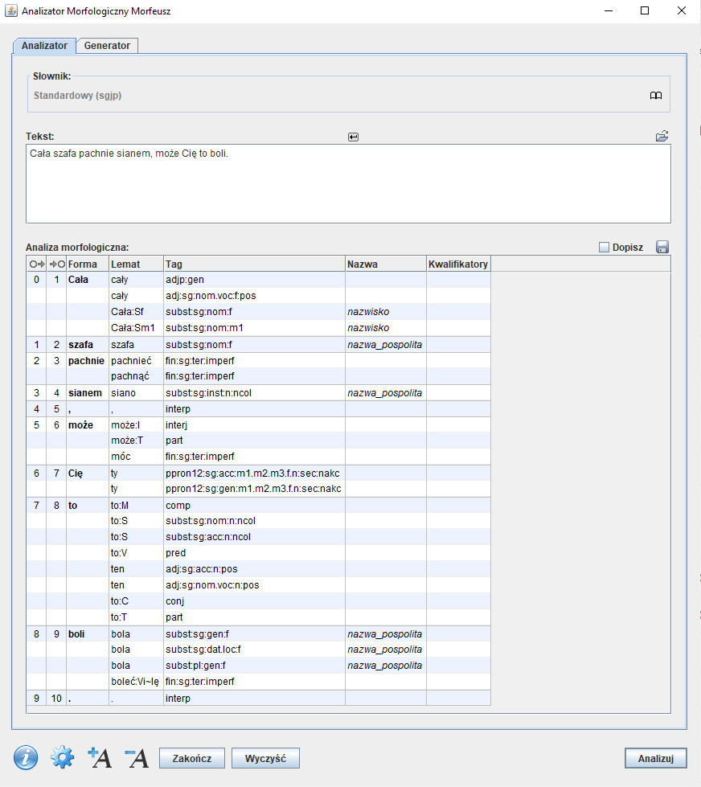

# image-captioning w języku polskim

Na tym githubie znajduje się opis wybranych zagadnień używanych w image captioning do języka polskiego. 
W opis wchodzą takie rzeczy jak sposób korzystania, teoretyczny opis, jak się korzysta, 
w jakich artykułach zostały opublikowane, itp. 

Lista zagadnień:
- stemming
- leamatyzacja
- tagowanie
- tokenizacja
- korpusy językowe
- zbiory uczące
- zbiory do wstępnego uczenia
- word embeddings
- przetwarzanie języka naturalnego

## Stemming

Stemming to inaczej proces wyciągnięcia rdzenia ze słowa (części, która jest odporna na odmiany 
przez przyimki, rodzaje, itp). 

### NTLK
NLTK zawiera dużo bibliotek wykonujących stemming na wiele sposobów jak i narzędzia wykonujące
inne funkcje. 
Jest to platforma, która tworzy aplikacje opierające się o dane dotyczące ludzkiego języka.
Udostępnia łatwe w użyciu interfejsy do ponad 50 korpusów i zasobów leksykalnych, takich jak WordNet,
wraz z zestawieniem bibliotek do przetwarzania tekstu do klasyfikacji, tokenizacji, stemmingu,
tagowania, parsowania, wnioskowania semantycznego oraz wrapperami do bibliotek NLP o znaczeniu przemysłowym.

NLTK dostarcza wiele implementacji różnych algorytmów, między innymi:
* arlstem - do języka Arabskiego
* cistem - do języka Niemieckiego
* isri - do języka Arabskiego
* rslp - do języka Portugalskiego
* snowball - obsługuje parenaście języków, niestety bez języka polskiego
* lancester - oparty na algorytmie Lancestera
* porter - oparty na algorytmie Portera

Dla przykładu sposób działania stemmera Regexp, który używa wyrażeń regularnych do identyfikacji 
afiksów morfologicznych i usuwa wszystkie podłańcuchy pasujące do wyrażeń regularnych:
```python
>>> from nltk.stem import RegexpStemmer
>>> st = RegexpStemmer('ing$|s$|e$|able$', min=4)
>>> st.stem('cars')
'car'
>>> st.stem('mass')
'mas'
>>> st.stem('was')
'was'
>>> st.stem('bee')
'bee'
>>> st.stem('compute')
'comput'
>>> st.stem('advisable')
'advis'
```

Więcej informacji apropo każdego z wymienionych stemmerów znajduje się [tutaj](https://www.nltk.org/api/nltk.stem.html).

### Stempel
Jeśli chodzi specyficznie o język polski z pomocą przychodzi Stempel - stemmer początkowo 
napisany w javie. Został stworzony w projekcie [Egothor](https://www.egothor.org/product/egothor2/),
który polegał na stworzeniu Open Source wyszukiwarki tekstu ze wszystkimi funkcjami tego zagadnienia.
Po jakimś czasie zostal też włączony jako część [Apache Lucene](https://lucene.apache.org/core/3_1_0/api/contrib-stempel/index.html),
 darmowej i Open Source biblioteki wyszukiwarek. Jest on również wykorzystywana przez wyszukiwarkę 
Elastic Search.

Pakiet zawiera tabelki stemmingowe dla języka polskiego, oryginalnie przygotowane na
20,000 zestawach treningowych, oraz nową wersję przygotowaną na 259,000 zestawach ze
słownika Polimorf.

#### Przykład użycia:
Użycie oryginalnej wersji:
```python
>>> stemmer = StempelStemmer.default()
```
Lub wersji z nowszą tabelką steemingową pretrained na słowniku Polimorf:
```python
>>> stemmer = StempelStemmer.polimorf()
```
Użycie:
```python
>>> for word in ['książka', 'książki', 'książkami', 'książkowa', 'książkowymi']:
...   print(stemmer(word))
...
książek
książek
książek
książkowy
książkowy
```

Więcej informacji o steemerze znajduje się o [tutaj](https://github.com/dzieciou/pystempel).


## Lematyzacja i Tagowanie

Lematyzacja oznacza sprowadzenie grupy wyrazów stanowiących odmianę danego zwrotu do wspólnej 
postaci, umożliwiając traktowanie ich wszystkich jako to samo słowo. W przetwarzaniu języka 
naturalnego odgrywa rolę ujednoznaczenia, np. słowa "are", "is", "Am", pochodzą od słowa "Be".

Tagowanie to inaczej proces klasyfikowania słów na ich części mowy i odpowiedniego ich oznaczania .
Części mowy są również znane jako klasy słów lub kategorie leksykalne. Zbiór znaczników używanych 
w danym zadaniu nazywany jest zbiorem znaczników. Praca która dokładnie opisuje wiele aspektów
dotyczących tagowania znajduje się [tutaj](http://nlp.ipipan.waw.pl/Bib/kob:kie:16.pdf).

### Morfeusz 2

Morfeusz 2 stanowi nową implementację
analizatora morfologicznego dla języka polskiego. Poprzednie wersje programu  stały się 
podstawą wielu narzędzi przetwarzania języka, w szczególności kilku tagerów
i parserów języka polskiego. 
Wersja druga programu, opracowana jako część infrastruktury Clarin-PL,
różni się od porzednika wieloma ważnymi ulepszeniami.

Oto przykład wyników działania programu dla tekstu „Mam próbkę analizy morfologicznej.”:

|Segment	|Forma ortograficzna | 	Lemat                                | 	Znacznik                 |
| --------  | ------------------ |---------------------------------------|---------------------------|
|0–1	    |Mam	              | mama	                                 | subst:pl:gen:f            |
|        |                       | mamić	                                | impt:sg:sec:imperf        |
|        |                       | mieć	                                 | fin:sg:pri:imperf         |
|1–2	    |próbkę	               | próbka	                               | subst:sg:acc:f            |
|2–3	    |analizy	           | analiza	                              | subst:sg:gen:f            |
|        |                         |                                       | subst:pl:nom.acc.voc:f    |
|3–4	    |morfologicznej	        | morfologiczny | 	adj:sg:gen.dat.loc:f:pos |
|4–5	    |.	                    | .	       |  interp                   |

Istnieją trzy warianty danych fleksyjnych dostępnych w Morfeuszu 2:

* najstarszy — SIaT, przygotowany poprzez skonfrontowanie danych „Schematycznego 
indeksu a tergo polskich form wyrazowych” (SIaT) Jana Tokarskiego i Zygmunta Saloniego z
listą haseł słownika Doroszewskiego,
* SGJP, korzystający z danych „Słownika gramatycznego języka polskiego” — SGJP (dane liczbowe
można znaleźć tutaj),
* Polimorf, wykorzystujący słownik fleksyjny Polimorf stanowiący połączenie danych SGJP z 
tworzonymi społecznościowo danymi Morfologika/sjp.pl.

### Przykład użycia

##### GUI
Morfeusz 2 zawiera [GUI](http://morfeusz.sgjp.pl/download/gui/) napisane w C++.

 

##### Użycie z poziomu C++
[Dokumentacja](http://download.sgjp.pl/morfeusz/Morfeusz2.pdf) zawiera sześć stron (7-13) dokładnie opisanych kroków,
które należy wykonać do użycia interesująych nas opcji.

Przykład analizy z wektorem jako wynikiem:
```cpp
vector<MorphInterpretation> r;
m->analyse("Załóż gąbkę na klawesyn.", r)
```
Przykład analizy w stylu iteratorowym:
```cpp
ResultsIterator *r=m->analyse("Załóż gąbkę na klawesyn.");
while(r->hasNext()) {
    MorphInterpretation i=r->next();
        cout << i.startNode <<" "
        << i.endNode <<" "
        << i.orth <<" "
        << i.lemma <<" "
        << i.getTag(*morfeusz) <<" "
        << i.getName(*morfeusz) <<" "
        << i.getLabelsAsString(*morfeusz)
        << endl;
}
```

### Morfeusz w języku Python

Interfejs języka Python różni się nieco od interfejsu C++ ze względu na
własności języka i przyjęte w środowisku pythonowym obyczaje.
Użycie Morfeusza wymaga zaimportowania w programie biblioteki i stworzenia obiektu reprezentującego Morfeusza: morfeusz2:

```python
import morfeusz2
morf = morfeusz2.Morfeusz()
```
Obiekt utworzony bez podawania parametrów konstruktora będzie używał domyślnego słownika SGJP i 
domyślnych ustawień opcji.

Dwie najważniejsze metody klasy Morfeusz to analyse oraz generate.
Pierwsza z nich zwraca graf analizy morfoskładniowej dla podanego napisu
w postaci listy trójek uporządkowanych reprezentujących pojedyncze interpretacje poszczególnych segmentów (czyli krawędzie w grafie analizy). Każda
trójka składa się z indeksów węzła początkowego i końcowego danej krawędzi
oraz z interpretacji morfoskładniowej, stanowiącej etykietę krawędzi. Interpretacja to piątka uporządkowana zawierająca:
* formę tekstową,
* lemat (formę bazową/hasłową),
* znacznik morfoskładniowy,
* listę informacji o „pospolitości” rzeczownika (np. nazwa pospolita, marka,
nazwisko),
8 listę kwalifikatorów stylistycznych (np. daw., pot., środ., wulg.) i dziedzinowych (np. bot., zool.).

Segmenty nieznane słownikowi otrzymują specjalny znacznik ign oraz lemat
równy formie tekstowej.

```python
for text in (u'Jaś miał kota', u'Coś zrobił?', u'qwerty'):
print(text)
analysis = morf.analyse(text)
for interpretation in analysis:
print(interpretation)
```

Metoda generate zwraca listę interpretacji morfoskładniowych (w postaci
piątek, jw.) wszystkich form, dla których podany tekst stanowi formę bazową:
```python
morf.generate(u'piec')
```
W odróżnieniu od analyse, generate akceptuje tylko napisy stanowiące pojedyncze słowo (bez spacji), w przeciwnym
przypadku zostanie zgłoszony wyjątek.

Więcej informacji apropo używania morfeusza w pythonie znajduje się w [dokumentacji morfeusza](http://download.sgjp.pl/morfeusz/Morfeusz2.pdf)
na stronach
14-16.

## Tokenizacja 

Tokenizatory dzielą ciągi znaków na listy podłańcuchów, na przykład mogą 
być używane do znajdowania słów i znaków interpunkcyjnych w łańcuchu znaków.

### NTLK
Przykład użycia tokenizatora z [paczki NTLK](https://www.nltk.org/api/nltk.tokenize.html), najprostszy moduuł
tokenizujący:
```python
>>> from nltk.tokenize import word_tokenize
>>> s = '''Good muffins cost $3.88\nin New York.  Please buy me
... two of them.\n\nThanks.'''
>>> word_tokenize(s)
['Good', 'muffins', 'cost', '$', '3.88', 'in', 'New', 'York', '.',
'Please', 'buy', 'me', 'two', 'of', 'them', '.', 'Thanks', '.']
```

NLTK udostępnia również prostszy tokenizer oparty na wyrażeniach regularnych, który
dzieli tekst na podstawie spacji i interpunkcji:

```python
>>> from nltk.tokenize import wordpunct_tokenize
>>> wordpunct_tokenize(s)
['Good', 'muffins', 'cost', '$', '3', '.', '88', 'in', 'New', 'York', '.',
'Please', 'buy', 'me', 'two', 'of', 'them', '.', 'Thanks', '.']
```

Możemy również operować na poziomie zdań, używając tokenizatora zdań 
w następujący sposób:

```python
>>> from nltk.tokenize import sent_tokenize, word_tokenize
>>> sent_tokenize(s)
['Good muffins cost $3.88\nin New York.', 'Please buy me\ntwo of them.', 'Thanks.']
>>> [word_tokenize(t) for t in sent_tokenize(s)]
[['Good', 'muffins', 'cost', '$', '3.88', 'in', 'New', 'York', '.'],
['Please', 'buy', 'me', 'two', 'of', 'them', '.'], ['Thanks', '.']]
```

## Modele językowe 

Model propabilistyczny, którego celem jest obliczenie prawdopodobieństwa wystąpienia kolejnego słowa po zadanej wcześniej sekwencji słów. Na podstawie modelu językowego możemy oszacować następne najbardziej prawdopodobne słowo.

Na samym początku wspomnę o rankingu klej - który jest polskim odpowiednikiem angielskiego rankingu GLUE. Został stworzony przez Allegro, i określa ranking najlepszych modeli językowych dla językach polskiego. Rankking możemy znaleźć o [tutaj](https://klejbenchmark.com/leaderboard/)

Do tej pory pionierem do spraw języka naturalnego w wielu językach był googlowski BERT, jednak w klasyfikacji GLUE dostał tylko 80 na 100 punktów. Na podstawie BERT’a powstał Polski RoBERT, który osiągnął 87/100 punktów w teście KLEJ, a jeszcze potem na podstawie RoBERTA powstał HerBERT, osiągając najwyższą do tej pory notę 88/100.


### Hugging Transformers

[Strona HuggingTransformers](https://huggingface.co/models?sort=downloads) zawiera ogromną ilość modeli
do zagadnień takich jak postrzeganie obrazów przez maszyny, NLP, rozpoznawania mowy i dźwięku, itp.

Oto lista zagadnień:


Po wybraniu interesującego nas tagu dostajemy listę modeli dostępnych na stronie:


### BERT

Model stworzony przez Google, na jego podstawie stworzono najlepsze polskie modele. Architektura BERT polega na nauce poprzez usuwanie ze zdania losowo kilka słów, i następnie model ma się nauczyć jak najlepiej wypełnić te dziury. Przy odpowiednio dużym korpusie z czasem  model coraz lepiej poznaje zależności semantyczne między słowami. Został stworzony przy pomocy [Huggingface Transformers](https://github.com/huggingface/transformers), i ma dwa warianty: 

#### Uncased  


Polbert został przetrenowany przez kod z googlowskiego [BERTa](https://github.com/google-research/bert), ma architekture bert-based-uncased (12 warstw, 768 ukrytych, 12 heads, 110M parametrów). Set-up modelu:
- 100.000 kroków - 128 sequence length, batch size 512, learning rate 1e-4 (10.000 steps warmup)
- 800.000 kroków - 128 sequence length, batch size 512, learning rate 5e-5
- 100.000 kroków - 512 sequence length, batch size 256, learning rate 2e-5

Sposób użycia:

```python
from transformers import *
model = BertForMaskedLM.from_pretrained("dkleczek/bert-base-polish-uncased-v1")
tokenizer = BertTokenizer.from_pretrained("dkleczek/bert-base-polish-uncased-v1")
nlp = pipeline('fill-mask', model=model, tokenizer=tokenizer)
for pred in nlp(f"Adam Mickiewicz wielkim polskim {nlp.tokenizer.mask_token} był."):
  print(pred)
# Output:
# {'sequence': '[CLS] adam mickiewicz wielkim polskim poeta był. [SEP]', 'score': 0.47196975350379944, 'token': 26596}
# {'sequence': '[CLS] adam mickiewicz wielkim polskim bohaterem był. [SEP]', 'score': 0.09127858281135559, 'token': 10953}
# {'sequence': '[CLS] adam mickiewicz wielkim polskim człowiekiem był. [SEP]', 'score': 0.0647173821926117, 'token': 5182}
# {'sequence': '[CLS] adam mickiewicz wielkim polskim pisarzem był. [SEP]', 'score': 0.05232388526201248, 'token': 24293}
# {'sequence': '[CLS] adam mickiewicz wielkim polskim politykiem był. [SEP]', 'score': 0.04554257541894913, 'token': 44095}
```

#### Cased

Wszystko takie same jak w cased, tylko że ze zmianą na "Whole Word Masking" - maskowanie wszystkich podsłów danego słowa.

Sposób użycia:

```python
model = BertForMaskedLM.from_pretrained("dkleczek/bert-base-polish-cased-v1")
tokenizer = BertTokenizer.from_pretrained("dkleczek/bert-base-polish-cased-v1")
nlp = pipeline('fill-mask', model=model, tokenizer=tokenizer)
for pred in nlp(f"Adam Mickiewicz wielkim polskim {nlp.tokenizer.mask_token} był."):
  print(pred)
# Output:
# {'sequence': '[CLS] Adam Mickiewicz wielkim polskim pisarzem był. [SEP]', 'score': 0.5391148328781128, 'token': 37120}
# {'sequence': '[CLS] Adam Mickiewicz wielkim polskim człowiekiem był. [SEP]', 'score': 0.11683262139558792, 'token': 6810}
# {'sequence': '[CLS] Adam Mickiewicz wielkim polskim bohaterem był. [SEP]', 'score': 0.06021466106176376, 'token': 17709}
# {'sequence': '[CLS] Adam Mickiewicz wielkim polskim mistrzem był. [SEP]', 'score': 0.051870670169591904, 'token': 14652}
# {'sequence': '[CLS] Adam Mickiewicz wielkim polskim artystą był. [SEP]', 'score': 0.031787533313035965, 'token': 35680}
```


Wyniki obydwu wariantów w rankingu KLEJ:
- Polbert cased 81.7
- Polbert uncased 81.4

### RoBERTa

Model stworzony przez Ośrodek Przetwarzania Informacji na podstawie BERTa. Powstały dwa modele, large i base, z czego large został wytrenowany na około 130GB danych, a do mniejszy na 20GB - wśród korpusy znajdowały się wysokiej jakości teksty z wikipedii, dokumenty polskiego parlamentu, wypowiedzi z mediów społecznościowych, książki, artykuły, oraz dłuższe formy pisane. Z obu można korzystać w zależności od potrzeb i możliwości technicznych. Pierwszy oferuje większą precyzje ale zarazem wymaga większej mocy obliczeniowej, gdzie drugi jest szybszy lecz ofertuje nieco gorsze wyniki.

Modele zostały wytrenowane na dwa sposoby, korzystając z toolkitu [fairseq](https://github.com/pytorch/fairseq) 
i [Huggingface Transformers](https://github.com/huggingface/transformers). Fairseq służy do
modelowania sekwencyjnego i pozwala trenenować nieszablonowe modele do tłumaczeń, modeli 
językowych, uogalniania oraz innych zadań związanych z tekstem, gdzie Huggingface dostarcza 
tysiące pre-trained modeli do zadań dotyczących tekstu, obrazów, oraz audio.


<table>
<thead>
<th>Model</th>
<th>L / H / A*</th>
<th>Batch size</th>
<th>Update steps</th>
<th>Corpus size</th>
<th>KLEJ Score**</th> 
<th>Fairseq</th>
<th>Transformers</th>
</thead>
<tr>
  <td>RoBERTa&nbsp;(base)</td>
  <td>12&nbsp;/&nbsp;768&nbsp;/&nbsp;12</td>
  <td>8k</td>
  <td>125k</td>
  <td>~20GB</td>
  <td>85.39</td>
  <td>
  <a href="https://github.com/sdadas/polish-roberta/releases/download/models/roberta_base_fairseq.zip">v0.9.0</a>
  </td>
  <td>
  <a href="https://github.com/sdadas/polish-roberta/releases/download/models-transformers-v3.4.0/roberta_base_transformers.zip">v3.4</a>
  </td>
</tr>
<tr>
  <td>RoBERTa&#8209;v2&nbsp;(base)</td>
  <td>12&nbsp;/&nbsp;768&nbsp;/&nbsp;12</td>
  <td>8k</td>
  <td>400k</td>
  <td>~20GB</td>
  <td>86.72</td>
  <td>
  <a href="https://github.com/sdadas/polish-roberta/releases/download/models-v2/roberta_base_fairseq.zip">v0.10.1</a>
  </td>
  <td>
  <a href="https://github.com/sdadas/polish-roberta/releases/download/models-v2/roberta_base_transformers.zip">v4.4</a>
  </td>
</tr>
<tr>
  <td>RoBERTa&nbsp;(large)</td>
  <td>24&nbsp;/&nbsp;1024&nbsp;/&nbsp;16</td>
  <td>30k</td>
  <td>50k</td>
  <td>~135GB</td>
  <td>87.69</td>
  <td>
  <a href="https://github.com/sdadas/polish-roberta/releases/download/models/roberta_large_fairseq.zip">v0.9.0</a>
  </td>
  <td>
  <a href="https://github.com/sdadas/polish-roberta/releases/download/models-transformers-v3.4.0/roberta_large_transformers.zip">v3.4</a>
  </td>
</tr>
<tr>
  <td>RoBERTa&#8209;v2&nbsp;(large)</td>
  <td>24&nbsp;/&nbsp;1024&nbsp;/&nbsp;16</td>
  <td>2k</td>
  <td>400k</td>
  <td>~200GB</td>
  <td>88.87</td>
  <td>
  <a href="https://github.com/sdadas/polish-roberta/releases/download/models-v2/roberta_large_fairseq.zip">v0.10.2</a>
  </td>
  <td>
  <a href="https://github.com/sdadas/polish-roberta/releases/download/models-v2/roberta_large_transformers.zip">v4.14</a>
  </td>
</tr>
  <tr>
  <td>DistilRoBERTa</td>
  <td>6&nbsp;/&nbsp;768&nbsp;/&nbsp;12</td>
  <td>1k</td>
  <td>10ep.</td>
  <td>~20GB</td>
  <td>84.55</td>
  <td>
  n/a
  </td>
  <td>
  <a href="https://github.com/sdadas/polish-roberta/releases/download/models-v2/distilroberta_transformers.zip">v4.13</a>
  </td>
</tr>
</table>

\* L - the number of encoder blocks, H - hidden size, A - the number of attention heads <br/>

#### Jak używać z Fairseq:

```python
import os
from fairseq.models.roberta import RobertaModel, RobertaHubInterface
from fairseq import hub_utils

model_path = "roberta_large_fairseq"
loaded = hub_utils.from_pretrained(
    model_name_or_path=model_path,
    data_name_or_path=model_path,
    bpe="sentencepiece",
    sentencepiece_vocab=os.path.join(model_path, "sentencepiece.bpe.model"),
    load_checkpoint_heads=True,
    archive_map=RobertaModel.hub_models(),
    cpu=True
)
roberta = RobertaHubInterface(loaded['args'], loaded['task'], loaded['models'][0])
roberta.eval()
input = roberta.encode("Zażółcić gęślą jaźń.")
output = roberta.extract_features(input)
print(output[0][1])
```

#### Jak używać Hugging Transformers

```python
import torch, os
from transformers import RobertaModel, AutoModel, PreTrainedTokenizerFast

model_dir = "roberta_base_transformers"
tokenizer = PreTrainedTokenizerFast(tokenizer_file=os.path.join(model_dir, "tokenizer.json"))
model: RobertaModel = AutoModel.from_pretrained(model_dir)
input = tokenizer.encode("Zażółcić gęślą jaźń.")
output = model(torch.tensor([input]))[0]
print(output[0][1])
```

### HerBERT

Najlepiej sprawujący się model językowy do języka polskiego. Oparty jest na strukturze BERTa, a wzoruje się centralnie na RoBERTcie. Jest jego zoptymalizowaną i zmodyfikowaną wersją, która została przetrenowana na większej ilości danych. Istnieją trzy warianty:

| Model | Tokenizer | Vocab Size | Batch Size | Train Steps | KLEJ Score |
| :---- | --------: | ---------: | ---------: | ----------: | ---------: | 
| `herbert-klej-cased-v1` | BPE | 50K | 570 | 180k | 80.5 |
| `herbert-base-cased` | BPE-Dropout | 50K | 2560 | 50k | 86.3 |
| `herbert-large-cased` | BPE-Dropout | 50K | 2560 | 60k | 88.4 |

Przykład jak załadować model:

```python
from transformers import AutoTokenizer, AutoModel

model_names = {
    "herbert-klej-cased-v1": {
        "tokenizer": "allegro/herbert-klej-cased-tokenizer-v1", 
        "model": "allegro/herbert-klej-cased-v1",
    },
    "herbert-base-cased": {
        "tokenizer": "allegro/herbert-base-cased", 
        "model": "allegro/herbert-base-cased",
    },
    "herbert-large-cased": {
        "tokenizer": "allegro/herbert-large-cased", 
        "model": "allegro/herbert-large-cased",
    },
}

tokenizer = AutoTokenizer.from_pretrained(model_names["allegro/herbert-base-cased"]["tokenizer"])
model = AutoModel.from_pretrained(model_names["allegro/herbert-base-cased"]["model"])
```

Przykład jak używać modelu:

```python
output = model(
    **tokenizer.batch_encode_plus(
        [
            (
                "A potem szedł środkiem drogi w kurzawie, bo zamiatał nogami, ślepy dziad prowadzony przez tłustego kundla na sznurku.",
                "A potem leciał od lasu chłopak z butelką, ale ten ujrzawszy księdza przy drodze okrążył go z dala i biegł na przełaj pól do karczmy."
            )
        ],
        padding="longest",
        add_special_tokens=True,
        return_tensors="pt",
    )
)
```


[Praca](https://aclanthology.org/2021.bsnlp-1.1/) w której został dokładnie opisany HerBERT.

### Model językowy autorstwa Teresy Sas

Model jest zbudowany na zasobach tekstów o tematyce akademickiej i ogólnej, obejmując prawie 800 tyś. słów. W linku możemy pobrać zipa w którym znajdują się trzy pliki:
•	model_2d_forward.txt - model bigramowy zawierający prawdopodobieństwa następstwa słów p(w_i | w_{i-1} ) dla porządku od lewej do prawej
•	model 3d_bakward.txt - model trigramowy zawierający prawdopodobieństwa p( w_i | w_{i+1} w_{i+2} ) dla porządku odwróconego
•	word_list.txt - lista słów występujących w modelu

Model może być wykorzystany w badaniach nad rozpoznawaniem mowy i w inżynierii języka naturalnego dla języka polskiego.

Więcej informacji apropo modelu można zaleźć o [tutaj](https://zasobynauki.pl/zasoby/model-jezykowy-dla-jezyka-polskiego,55644/).


## Word embeddings

### Ewaluacja polskich word embeddingów stworzona przez wiele grup badawczych

W powyższej implementacji została użyta biblioteka „gensim”, która pozwala wczytać dane, wytrenować model, 
oraz końcowo sprawdzić wyniki. Oprócz tworzenia wektorowych przedstawień słów biblioteka ma wiele innych funkcji,
między innymi może znajdować semantycznie podobne dokumenty do tego który został jej zadany. Żeby określić 
word-embedinngi w powyższej implementacji używana jest funkcja "evaluation_word_pairs" oraz "assessment_word_analogies" z biblioteki gensim.

Do testowania został użyty plik dostarczony przez [facebook fastext](https://dl.fbaipublicfiles.com/fasttext/vectors-crawl/cc.pl.300.vec.gz). Żeby określić podobieństwo słów użyto polskiej wersji [SimLex999](http://zil.ipipan.waw.pl/CoDeS?action=AttachFile&do=view&target=MSimLex999_Polish.zip), stworzonej przez IPIPAN.

Dokładniejszy opis jak i Obszerna tabelka z wynikami znajduje się w podanym w pierwszej linijce linku.

### Opis word embeddingów Sławomira Dadasa

Poniższe rozdziały zawierają pretrained word embeddings dla językach polskiego. Każdy model został wytrenowany
na korpusie składającym się z zasobów polskiej Wikipedii, polskich książek i artykułów, w sumie 1,5 miliarda tokenów.

#### Word2vec
Word2Vec został wytrenowany za pomocą biblioteki Gensim. 100 wymiarów, próbkowanie negatywne, zawiera lematyzowane słowa, 
które mają 3 lub więcej wystąpień w korpusie oraz dodatkowo zestaw predefiniowanych symboli interpunkcyjnych, 
wszystkie liczby od 0 do 10000, polskie imiona i nazwiska. 

 Przykład użycia:
```python
from gensim.models import KeyedVectors

if __name__ == '__main__':
    word2vec = KeyedVectors.load("word2vec_polish.bin")
    print(word2vec.similar_by_word("bierut"))
    
# [('cyrankiewicz', 0.818274736404419), ('gomułka', 0.7967918515205383), ('raczkiewicz', 0.7757788896560669), ('jaruzelski', 0.7737460732460022), ('pużak', 0.7667238712310791)]
```
Prezentacja dotycząca Word2Vec znajduje się o [tutaj](Prezentacja dotycząca Word2Vec znajduje się o [tutaj](http://compling.hss.ntu.edu.sg/courses/hg7017/pdf/word2vec%20and%20its%20application%20to%20wsd.pdf).

#### FastText

FastText trenowany za pomocą biblioteki Gensim. Słownictwo i wymiarowość są identyczne jak w modelu Word2Vec. 

Przykład użycia:

```python
from gensim.models import KeyedVectors

if __name__ == '__main__':
    word2vec = KeyedVectors.load("fasttext_100_3_polish.bin")
    print(word2vec.similar_by_word("bierut"))
    
# [('bieruty', 0.9290274381637573), ('gierut', 0.8921363353729248), ('bieruta', 0.8906412124633789), ('bierutow', 0.8795544505119324), ('bierutowsko', 0.839280366897583)]
```

#### GloVe

Globalne wektory do reprezentacji słów (GloVe) trenowane przy użyciu implementacji referencyjnej ze Stanford NLP. 
100 wymiarów, zawiera lematyzowane słowa, które mają 3 lub więcej wystąpień w korpusie. 

Przykład użycia:

```python
from gensim.models import KeyedVectors

if __name__ == '__main__':
    word2vec = KeyedVectors.load_word2vec_format("glove_100_3_polish.txt")
    print(word2vec.similar_by_word("bierut"))
    
# [('cyrankiewicz', 0.8335597515106201), ('gomułka', 0.7793121337890625), ('bieruta', 0.7118682861328125), ('jaruzelski', 0.6743760108947754), ('minc', 0.6692837476730347)]
```

#### Skompresowane Word2vec

Jest to skompresowana wersja opisanego powyżej modelu Word2Vec. Do kompresji wykorzystano metodę opisaną w 
[Compressing Word Embeddings via Deep Compositional Code Learning](https://arxiv.org/abs/1711.01068) autorstwa Shu
i Nakayamy. Skompresowane embeddingi 
nadają się do stosowania w urządzeniach o ograniczonej pamięci, takich jak telefony komórkowe. Model waży 38 MB, co 
stanowi zaledwie 4,4% rozmiaru oryginalnych embeddingów Word2Vec. Mimo że autorzy artykułu twierdzą, że kompresja ich
metodą nie wpływa na wydajność modelu, został zauważony niewielki, ale akceptowalny spadek dokładności, przy użyciu 
skompresowanej wersji embeddingów.

Przykładowa klasa dekodera wraz z użyciem:
```python
import gzip
from typing import Dict, Callable
import numpy as np

class CompressedEmbedding(object):

    def __init__(self, vocab_path: str, embedding_path: str, to_lowercase: bool=True):
        self.vocab_path: str = vocab_path
        self.embedding_path: str = embedding_path
        self.to_lower: bool = to_lowercase
        self.vocab: Dict[str, int] = self.__load_vocab(vocab_path)
        embedding = np.load(embedding_path)
        self.codes: np.ndarray = embedding[embedding.files[0]]
        self.codebook: np.ndarray = embedding[embedding.files[1]]
        self.m = self.codes.shape[1]
        self.k = int(self.codebook.shape[0] / self.m)
        self.dim: int = self.codebook.shape[1]

    def __load_vocab(self, vocab_path: str) -> Dict[str, int]:
        open_func: Callable = gzip.open if vocab_path.endswith(".gz") else open
        with open_func(vocab_path, "rt", encoding="utf-8") as input_file:
            return {line.strip():idx for idx, line in enumerate(input_file)}

    def vocab_vector(self, word: str):
        if word == "<pad>": return np.zeros(self.dim)
        val: str = word.lower() if self.to_lower else word
        index: int = self.vocab.get(val, self.vocab["<unk>"])
        codes = self.codes[index]
        code_indices = np.array([idx * self.k + offset for idx, offset in enumerate(np.nditer(codes))])
        return np.sum(self.codebook[code_indices], axis=0)

if __name__ == '__main__':
    word2vec = CompressedEmbedding("word2vec_100_3.vocab.gz", "word2vec_100_3.compressed.npz")
    print(word2vec.vocab_vector("bierut"))
```

Więcej informacji o word embeddingach możemy znaleźć o [tutaj](https://github.com/sdadas/polish-nlp-resources).


## Zbiory danych

[Zbiór](https://opus.nlpl.eu/OpenSubtitles-v2018.php) zawierający między innymi polskie napisy do filmów. Z dwóch źródeł się dowiedziałem, że zawiera sporo powtórzeń.

```text
The Loner You love curry, right? I'll give you more. Hey! Is it good? Hey, ugly. Look at her. - Craz...
```
[Zbiór](https://dl.fbaipublicfiles.com/fasttext/word-analogies/questions-words-pl.txt) zawierjający analogie ("Ateny Grecja Bagdad Irak")
, przydatny do word embedinggsów.

```text
Ateny Grecja Ottawa Kanada
Ateny Grecja ParyĹź Francja
Ateny Grecja Rzym Włochy
Ateny Grecja Sztokholm Szwecja
Ateny Grecja Teheran Iran
Ateny Grecja Tokio Japonia
Bagdad Irak Ateny Grecja
Bagdad Irak Bangkok Tajlandia
Bagdad Irak Pekin Chiny
Bagdad Irak Berlin Niemcy
Bagdad Irak Berno Szwajcaria
Bagdad Irak Kair Egipt
```
### Korpusy językowe

Korpus językowy to zbiór tekstów służących badaniom lingwistycznym, np. określaniu częstości występowania 
form wyrazowych, konstrukcji składniowych lub kontekstów, w jakich pojawiają się dane wyrazy.

#### Korpus NKJP
Narodowy Korpus Języka Polskiego jest wspólną inicjatywą Instytutu Podstaw Informatyki PAN (koordynator), Instytutu Języka Polskiego PAN, Wydawnictwa Naukowego PWN oraz Zakładu Językoznawstwa Komputerowego i Korpusowego Uniwersytetu Łódzkiego, zrealizowaną jako projekt badawczy rozwojowy Ministerstwa Nauki i Szkolnictwa Wyższego.

Te cztery instytucje wspólnie zbudowały korpus referencyjny polszczyzny wielkości ponad półtora miliarda słów. Wyszukiwarki korpusowe pozwalają przeszukiwać zasoby NKJP zaawansowanymi narzędziami uwzględniającymi odmianę polskich wyrazów, a nawet analizującymi budowę polskich zdań.

Lista źródeł korpusu zawiera nie tylko klasykę literatury polskiej, ale też prasę codzienną i specjalistyczną, nagrania rozmów, teksty ulotne i internetowe. Zróżnicowanie tematyczne i gatunkowe tekstów, dbałość o reprezentację rozmówców obu płci, w różnym wieku i z różnych regionów, są dla wiarygodności korpusu równie ważne jak jego wielkość.

Na podstawie korpusu powstały dwie wyszukiwarki:
* IPI PAN

http://nkjp.pl/poliqarp/

Używany między innymi do Morfeusza 2.

[Ściągawka](http://nkjp.pl/poliqarp/help/pl.html) do używania korpusu. Znajdują się w niej między innymi zapytania o:
* 
  * segmenty
  * formy podstawowe
  * znaczniki morfosyntaktyczne
  * wieloznaczność i dezambiguacja


* [PELCRA](http://www.nkjp.uni.lodz.pl/)

Wyszukiwarka korpusowa PELCRA dla danych NKJP powstała w ramach projektu Narodowy Korpus Języka Polskiego. 
Umożliwia ona przeszukiwanie zrównoważonej wersji korpusu (ponad 250 milionów słów tekstowych, czyli ok. 
300 milionów segmentów) oraz całej puli danych NKJP (ok. 1500 milionów słów tekstowych, czyli ok. 1800 
milionów segmentów) zebranych w ramach projektu.

Wyszukiwarkę PELCRA cechuje łatwość użycia oraz szybkość zwracania nawet bardzo dużych zbiorów wyników, 
które można także pobierać w postaci arkuszy kalkulacyjnych. Specjalna składnia zapytań umożliwia też 
stosowanie rozszerzeń morfologicznych oraz ortograficznych, wyszukiwanie w jednym zapytaniu wariantów 
leksykalnych i elastycznych związków frazeologicznych.


#### [Korpus opisanych obrazów z adnotacjami](http://zil.ipipan.waw.pl/Scwad/AIDe)

AIDe jest korpusem opisów obrazów w języku polskim. Składa się on z 2 tys. opisów w języku naturalnym do 
1 tys. obrazów. Opisy są analizowane morfosyntaktycznie (znakowanie części mowy i parsowanie zależności),
a pary tych opisów są adnotowane pod względem pokrewieństwa semantycznego i entailmentu. Wszystkie adnotacje 
zostały przygotowane przez osoby o dużym doświadczeniu językowym.

Zbiór danych może być wykorzystany do oceny różnych systemów integrujących język i wizję. Nadaje się 
do oceny systemów przeznaczonych do generowania obrazów na podstawie dostarczonych opisów (generowanie 
tekstu do obrazu) lub do generowania podpisów na podstawie obrazów (generowanie obrazu do tekstu). 
Ponadto, ponieważ wybrane obrazy są podzielone na grupy tematyczne w oparciu o WordNet, zbiór danych 
jest również przydatny do walidacji metod klasyfikacji obrazów.


#### [Korpus dyskursu parlamentarnego](https://kdp.nlp.ipipan.waw.pl/query_corpus/)

Korpus Dyskursu Parlamentarnego jest zbiorem anotowanych lingwistycznie tekstów z posiedzeń plenarnych Sejmu 
i Senatu RP, interpelacji i zapytań poselskich oraz posiedzeń komisji od roku 1919 do chwili obecnej 
(są stale uzupełniane materiałami z kolejnych posiedzeń). Teksty opisane metadanymi oraz przetworzone 
automatycznie narzędziami lingwistycznymi (do segmentacji, analizy morfoskładniowej, rozpoznawania 
grup składniowych i nazw własnych) są dostępne do przeszukiwania oraz pobrania.


#### [Korpus dla smenatyki kompozycyjnej dystrybucyjnej](http://zil.ipipan.waw.pl/Scwad/CDSCorpus)

Składa się z 10 tys. polskich par zdań, które są opisane przez człowieka pod kątem pokrewieństwa semantycznego.
Zbiór danych może być wykorzystany do ewaluacji modeli kompozycyjnej semantyki dystrybucyjnej języka polskiego.


#### [Korpus polskich recenzji ](https://clarin-pl.eu/dspace/handle/11321/700)

Wrocławski Korpus Recenzji Konsumenckich jest korpusem polskich recenzji opatrzonych anotacją sentymentu na 
poziomie całego tekstu (*tekst*) oraz na poziomie zdań (*zdanie*) dla następujących dziedzin: hotele, medycyna, 
produkty i uczelnie (recenzje*). Zdania są opatrzone anotacją sentymentu tylko dla hoteli i medycyny. 
Każdy plik *sentence* zawiera pojedyncze zdanie z etykietą sentymentu __label__z_X, a każdy plik *text* 
zawiera pojedynczą recenzję z etykietą sentymentu __label__meta_X. 


#### [Korpus zawierający mowę nienawiści](http://zil.ipipan.waw.pl/HateSpeech)

Składa się z ponad 2000 postów scrapowanych z około 2000 postów z mediów społecznościowych. Pliki z rozszerzeniem
frm, MYI, MYD.


### Zbiory użyte do embeddingów

- https://clarin-pl.eu/dspace/handle/11321/442

Dystrybucyjny model języka wytrenowany na różnych korpusach językowych (KGR10, NKJP, Wikipedia).

- https://clarin-pl.eu/dspace/handle/11321/606

Dystrybucyjny model języka (tekstowy i binarny) dla języka polskiego (word embeddings) wytrenowany na korpusie KGR10 (ponad 4 miliardy słów) przy użyciu Fasttext w następujących wariantach (wszystkie możliwe kombinacje):

wymiar: 100, 300m, metoda: skipgram, cbow, narzędzie: FastText, Magnitude, tekst źródłowy: plain, plain.lower, plain.lemma, plain.lemma.lower


- https://clarin-pl.eu/dspace/handle/11321/600

Dystrybucyjny model języka (binarny) dla języka polskiego wytrenowany na KGR10 przy użyciu Fasttext (wymiar wektora: 100).
- https://clarin-pl.eu/dspace/handle/11321/327

Model skip gram z wektorami o długości 100. Trenowany na kgr 10, korpusie zawierającym ponad 
4 miliardy tokenów. Wstępne przetwarzanie danych obejmuje segmentację, lematyzację i dezambiguację 
mofosyntaktyczną z adnotacją MWE.
- http://vectors.nlpl.eu/repository -
6 polskich modeli:
  * Polish CommonCrawl Dump of December 2019, 35193029 słów, algorytm Gensim Continuous Skipgram 
  * Polish CommonCrawl Dump of December 2019, 35193029 słów, algorytm Gensim Continuous Bag-of-Words
  * Polish CommonCrawl Dump of December 2019, 4885806 słów, algorytm fastText Skipgram
  * Polish CommonCrawl Dump of December 2019, 4885806 słów, algorytm	fastText Continuous Bag-of-Words
  * Polish CoNLL17 corpus, algorytm Embeddings from Language Models (ELMo)
  * Polish CoNLL17 corpus, 4420598 słow, algorytm Word2Vec Continuous Skipgram

### Zbiory użyte do HerBERTa
- https://huggingface.co/datasets/allegro/klej-psc

extract_text
```text
Prywatna spółka KrzysztofaToeplitza od siedmiu lat wynajmuje atrakcyjną kamienicę na Starym Mieście. 
wątpliwości budzi umowa najmu. traci na niej skarb państwa. 1994 roku dyrektor ODZ, podpisał umowę najmu 
kamienicy z Towarzystwem Wydawniczym i Literackim. Pierwotna umowa została zmieniona. powiększano wynajmowaną 
powierzchnię. Wydłużono też okres wynajmu. W umowie nie uwzględniono jednak możliwości podniesienia czynszu.
```
summary_text
```text
W piątek w wielu uczelniach odbyły się uroczyste inauguracje roku akademickiego. Niestety, szybciej 
przybywa studentów niż środków na pomoc materialną w budżecie państwa. Tę sytuację tylko trochę łagodzą 
wprowadzone w ubiegłym roku preferencyjne kredyty. Zdecydowanie brakuje też miejsc w akademikach. Uczelnie 
państwowe coraz silniej odczuwają konieczność wprowadzenia odpłatności za studia. Jeżeli rząd nie przeznaczy 
na uczelnie wystarczających kwot w budżecie, to niezbędne będzie wprowadzenie częściowej odpłatności także za 
studia dzienne.
```
label
```text
0
```
- https://huggingface.co/datasets/allegro/klej-dyk

question
```text
z jakiego powodu zwołano synod w Whitby?
```

answer
```text
Wśród mnichów i mniszek mieszkających w Whitby, znajduje się wiele osób czczonych jako święte: św. Hilda - 
pochodząca z dynastii rządzącej Northumbrią, pierwsza ksieni opactwa; św. Edwin - król Northumbrii; św. 
Cedmon z Whitby - poeta; św. Bergu - mniszka i dziewica, miała wizję duszy św. Hildy w dniu jej śmierci; 
św. Trumwin - biskup Abercorn, schronił się w Whitby przed prześladowaniem; św. Elfleda - córka Oswiu, 
przysłana do klasztoru po jego klęsce w bitwie z Pendą z Mercji św. Bosa - biskup Yorku; św. Wilfrid - 
biskup Yorku; św. Enfleda - córka św. Edwina i żona św. Oswiu
```

target
```text
0
```
- https://huggingface.co/datasets/allegro/klej-polemo2-in

sentence
```text
Super lekarz i człowiek przez duże C . Bardzo duże doświadczenie i trafne diagnozy . Wielka cierpliwość do ludzi 
starszych . Od lat opiekuje się moją Mamą staruszką , i twierdzę , że mamy duże szczęście , że mamy takiego 
lekarza . Naprawdę nie wiem cobyśmy zrobili , gdyby nie Pan doktor . Dzięki temu , moja mama żyje . Każda wizyta 
u specjalisty jest u niego konsultowana i uważam , że jest lepszy od każdego z nich . Mamy do Niego prawie 
nieograniczone zaufanie . Można wiele dobrego o Panu doktorze jeszcze napisać . Niestety , ma bardzo dużo 
pacjentów , jest przepracowany ( z tego powodu nawet obawiam się o jego zdrowie ) i dostęp do niego jest 
trudny , ale zawsze możliwy .
```
target
```text
__label__meta_plus_m
```
- https://huggingface.co/datasets/allegro/klej-cdsc-e

sentence A
```text
Chłopiec w czerwonych trampkach skacze wysoko do góry nieopodal fontanny .
```

sentence B 
```text
Chłopiec w bluzce w paski podskakuje wysoko obok brązowej fontanny .
```
entailment_judgment
```text
NEUTRAL
```
- https://huggingface.co/datasets/allegro/klej-allegro-reviews

sentence 
```text
Jako do ceny dobra. Przyssawka mogłaby być lepsza. Po 2 miesiącach użytkowania musiałem nóżkę z przyssawką
rozkręcić i przyssawkę podkleić bo guma zaczęła pękać od strony mocowania do uchwytu (uchwyt zaczął się po 
prostu trząść bo zrobił się luz). Mechanizm mocowania telefonu póki co (3 miesiące użytkowania) działa bez zarzutu.
```
target 
```text
3
```
- https://huggingface.co/datasets/allegro/klej-polemo2-out

sentence
```text
Super lekarz i człowiek przez duże C . Bardzo duże doświadczenie i trafne diagnozy . Wielka cierpliwość do 
ludzi starszych . Od lat opiekuje się moją Mamą staruszką , i twierdzę , że mamy duże szczęście , że mamy 
takiego lekarza . Naprawdę nie wiem cobyśmy zrobili , gdyby nie Pan doktor . Dzięki temu , moja mama żyje . 
Każda wizyta u specjalisty jest u niego konsultowana i uważam , że jest lepszy od każdego z nich . Mamy do 
Niego prawie nieograniczone zaufanie . Można wiele dobrego o Panu doktorze jeszcze napisać . Niestety , ma 
bardzo dużo pacjentów , jest przepracowany ( z tego powodu nawet obawiam się o jego zdrowie ) i dostęp do 
niego jest trudny , ale zawsze możliwy .
```

target
```text
__label__meta_plus_m
```
- https://huggingface.co/datasets/allegro/klej-nkjp-ner

sentence 
```text
- Widzi pani , a Blokowa wzięła i się nie zastanawiała , i ma , i może robić , co chce .
```

target 
```text
noEntity
```
- https://huggingface.co/datasets/allegro/klej-cdsc-r

sentence A
```text
Chłopiec w czerwonych trampkach skacze wysoko do góry nieopodal fontanny .
```
sentence B
```text
Chłopiec w bluzce w paski podskakuje wysoko obok brązowej fontanny .
```
relatedness_score 
```text
3
```
- https://huggingface.co/datasets/allegro/klej-cbd

sentence
```text
@anonymized_account Dawno kogoś tak wrednego nie widziałam xd
```

target
```text
0
```
- https://huggingface.co/datasets/allegro/summarization-polish-summaries-corpus
```text
PODRĘCZNIKI We wrześniu wielu książek będzie brakować - twierdzą wydawcy Walka o ucznia ŁUKASZ GOŁĘBIEWSKI 
Wprowadzona od września tego roku reforma oświaty przewiduje konieczność wymiany wszystkich podręczników do 
IV klasy szkoły podstawowej i wydrukowania nowych książek do pierwszej klasy gimnazjum, która zastąpi siódmą
klasę podstawówki. W połowie czerwca nawet połowa nowych podręczników nie została jeszcze wydrukowana i
już dziś wiadomo, że we wrześniu wielu książek będzie brakować. W poprzednich latach wydawcy rozpoczynali
druk podręczników w marcu. Od czerwca zaczynał się sezon ich sprzedaży, którego kulminacja przypadała 
na koniec września. W tym roku w czerwcu sprzedaż książek szkolnych była o 80-90 proc. mniejsza, 
niż w latach ubiegłych. Nauczyciele nie wiedzą, jakie podręczniki polecać na następny rok, wydawcy 
czekają z drukiem na akceptację resortu edukacji, a Ministerstwo Edukacji Narodowej do 12 lipca wydłużyło
termin składania wniosków o wpis do rejestru książek dopuszczonych do nauki w szkołach. Bogata oferta 
- Wykaz książek zatwierdzonych przez MEN będzie dopiero pod koniec sierpnia - mówi Danuta Mieszkowska
z departamentu kształcenia i wychowania MEN. - Wydłużyliśmy okres składania wniosków o wpis do rejestru
na prośbę samych wydawców. Dotychczas wpłynęło ponad sto wniosków. Z naszego rozeznania wynika, że do
każdego przedmiotu w klasach objętych reformą będą co najmniej dwa podręczniki. Z naszej ankiety 
przeprowadzonej wśród wydawców książek szkolnych wynika, że będzie tych podręczników więcej: 3-4,
a do niektórych przedmiotów nawet 6. Razem z zeszytami ćwiczeń, które nie wymagają aprobaty MEN, 
w tym roku pojawi się ok. 400 nowych tytułów adresowanych do uczniów klas objętych reformą oraz 
klas I-III (tu nie ma konieczności wymiany książki, jednak wielu wydawców przygotowało na ten rok 
nowoczesne zintegrowane podręczniki). Wydawnictwa Szkolne i Pedagogiczne - potentat na tym rynku - szykują
nowe podręczniki do wszystkich zreformowanych klas, jednak nie wszystkie są już wydrukowane. - Najgorsza jest
niewiedza - mówi Iwona Ring, dyrektor ds. promocji w wydawnictwie. - Nie wiemy, czy wszystkie nasze 
podręczniki uzyskają akceptację MEN. Wielką niewiadomą są nakłady. Trudno przewidzieć, jak będą się sprzedawały 
nowe tytuły. Postanowiliśmy zaryzykować i będziemy drukować więcej, niż sprzedawaliśmy w latach ubiegłych. 
Dzięki temu we wrześniu będzie dużo naszych książek. Jeśli się nie sprzedadzą - albo pójdą na przemiał, albo
będą czekały na następny rok. Inni wydawcy są jednak ostrożniejsi niż WSiP. - Nie chcemy ryzykować i na 
początek drukujemy po 50 tys. każdego tytułu - mówi Piotr Oziębło, dyrektor wydawnictwa Juka-91. - Liczymy
, że sprzedamy trzy razy więcej, ale nie chcemy ponosić strat. - Pierwszy nakład każdego z naszych nowych 
podręczników to 60 tys. egzemplarzy - mówi Tomasz Gigol z Nowej Ery. - Nie ryzykujemy i z drukiem czekamy 
na akceptację książek przez MEN. W oczekiwaniu na kolejki Pod koniec sierpnia odbędzie się w Pałacu 
i Nauki w Warszawie specjalna edycja Targów Książki Edukacyjnej. Wszystko w związku z reformą oświaty i 
panującym na rynku zamieszaniem, które spowodowało, że w wielu szkołach uczniowie dowiedzą się dopiero we
wrześniu, z jakich książek mają się uczyć. Najgorzej, że nawet do klas, które nie są objęte reformą, 
sprzedaż książek bardzo spadła. - Ponieważ teraz rodzice nie kupują książek, należy oczekiwać, że we 
wrześniu, a nawet jeszcze w październiku, przed księgarniami będą ustawiały się kolejki - twierdzi 
Grzegorz Bartosiewicz, szef największej hurtowni książek szkolnych - Wkra. - Wielu tytułów we wrześniu 
zabraknie, bo wydawcy ostrożniej niż kiedykolwiek planują nakłady. Oznacza to, że w krótkim czasie do 
hurtowni wpłynie dużo tytułów, które stale trzeba będzie uzupełniać. W razie potrzeby, wprowadzę w swojej 
firmie pod koniec sierpnia 24-godzinny dzień pracy i przyjmę nowych pracowników. - Z całą pewnością we 
wrześniu będzie brakowało podręczników. Nauczyciele są zdezorientowani, wydawcy też. Ten rok dla wszystkich 
jest wielkim doświadczeniem - twierdzi Olgierd Buchocki, szef Gdańskiego Wydawnictwa Oświatowego. - To, co 
sprzedawano w pięć miesięcy, będzie trzeba sprzedać w 30 dni. Księgarze nie dadzą sobie z tym rady - uważa 
Marek Rożak, właściciel wydawnictwa edukacyjnego M. Rożak. Nowe firmy Reforma jest dla wydawcy wyzwaniem, 
ale i ogromną szansą. Na rynku edukacyjnym są największe nakłady książek i najszybszy przepływ gotówki. 
Wypromowanie nawet jednego podręcznika może oznaczać wzrost obrotów o kilkaset tysięcy złotych. Dlatego 
wydawcy od kilku miesięcy spotykają się z nauczycielami, wysyłają do szkół gratisowe egzemplarze książek, 
organizują konferencje metodyczne. - Nasze koszty na promocję w tym roku wzrosły kilkakrotnie - twierdzi 
Tomasz Gigol z Nowej Ery. - Zazwyczaj wysyłaliśmy nasze materiały do szkół raz w roku, a teraz, do czerwca, 
zrobiliśmy to już pięć razy (w tym 135 tys. egz. bezpłatnych książek). W tym roku o ucznia walczyć będzie 
wiele nowych na tym rynku firm: Znak, Prószyński i S-ka, Muza, LektorKlett. Reforma otwiera nowe możliwości. 
Wiadomo, że nauczyciele niechętnie zmieniają podręczniki, z których uczą. Teraz będą musieli. Ceny wzrosną 
Wydawnictwa Szkolne i Pedagogiczne przygotowały w tym roku 114 nowych podręczników, z czego dopiero połowa 
została wydrukowana. Wydawnictwo M. Rożak szykuje nowy podręcznik do przyrody (nowy przedmiot, który pojawi 
się w klasie IV) oraz historię, polski, geografię i biologię do gimnazjum. Gdańskie Wydawnictwo Oświatowe 
będzie miało nowe podręczniki do polskiego, historii i matematyki. Nowa Era szykuje książkę do przyrody oraz 
podręczniki do gimnazjum: biologię, chemię, fizykę, geografię, matematykę, technikę. Juka-91 drukuje nowy 
zintegrowany elementarz, podręcznik do przyrody i matematyki dla klas IV i historię dla gimnazjum. Res Polona 
będzie miała nową matematykę dla klas IV-VI i dla gimnazjum, fizykę dla gimnazjum i zintegrowany podręcznik 
do nauczania w klasach I-III. Zintegrowany podręcznik do nauczania początkowego szykuje też Didasko. Osiem 
nowych podręczników wyda oficyna Adam. Szesnaście nowych tytułów szykuje poznańska Arka... Wyliczać można d
ługo, bo w Polsce działa blisko 200 wydawnictw specjalizujących się w książce oświatowej. Ceny podręczników 
nieznacznie wzrosną - o ok. 10 proc. w porównaniu z rokiem ubiegłym (przykładowe ceny podajemy w tabelce). 
Pojedyncza książka kosztuje dziś w detalu ok. 13-21 złotych, zeszyt ćwiczeń 4-12 złotych. Co roku rodzice 
muszą jednak wydać od 100 do 200 złotych na podręczniki, co dla wielu domowych budżetów jest sporym obciążeniem. 
Ceny książek szkolnych nie różnią się znacznie, konkurencja powoduje, że wydawcy nie mają zbyt dużych możliwości 
ani podnoszenia, ani obniżania cen. Wiele zależy tu od Wydawnictw Szkolnych i Pedagogicznych, do których 
polityki cenowej dostosowują się mniejsi edytorzy. W ostatnich latach WSiP stosunkowo drogo sprzedawał książki 
osiągając co roku ogromne zyski. Urok ćwiczeń Nauczyciel będzie miał w czym wybierać. A nowe podręczniki 
kuszą kredowym papierem, pięknymi ilustracjami, bogatym zestawem ćwiczeń. W niczym nie przypominają tych,
z których uczyły się poprzednie pokolenia. Edytorsko są to obecnie jedne z najpiękniejszych książek 
na polskim rynku. Także tekst uległ przeobrażeniom. Nowe podręczniki mają uczyć samodzielnego myślenia, 
dlatego ich autorzy dbają o to, by uczeń utrwalał wiedzę dzięki licznym przykładom i ćwiczeniom, wykład 
zaś ograniczony jest do minimum tłumaczącego definicje i pojęcia. Liczne wykresy i ilustracje przemawiają 
do wyobraźni ucznia i ułatwiają szybkie zrozumienie tematu lekcji. Poziom podręczników jest wyrównany, 
tu wchodzą w grę zbyt duże pieniądze, by któryś wydawca mógł sobie pozwolić na wypuszczenie bubla.
```
target
```text
Krajowy Sąd Partyjny SLD wykluczył z partii byłą przewodniczącą dębickiego Sojuszu Marię Mazur i skarbnika
 Zbigniewa Kozioła za "postawę niegodną członka partii". Wykluczeni twierdzą, że stali się niewygodni. 
 Utrzymują, że nie chcieli tuszować matactw i zadarli z posłem Wiesławem Ciesielskim, szefem SLD w 
 Podkarpackiem, a od niedawna wiceministrem finansów, oraz ze Stanisławem Janasem, wiceprzewodniczącym 
 Rady Krajowej SLD. Zdaniem Kazimierza Jesionka oboje notorycznie łamali kartę zadas etycznych.
```